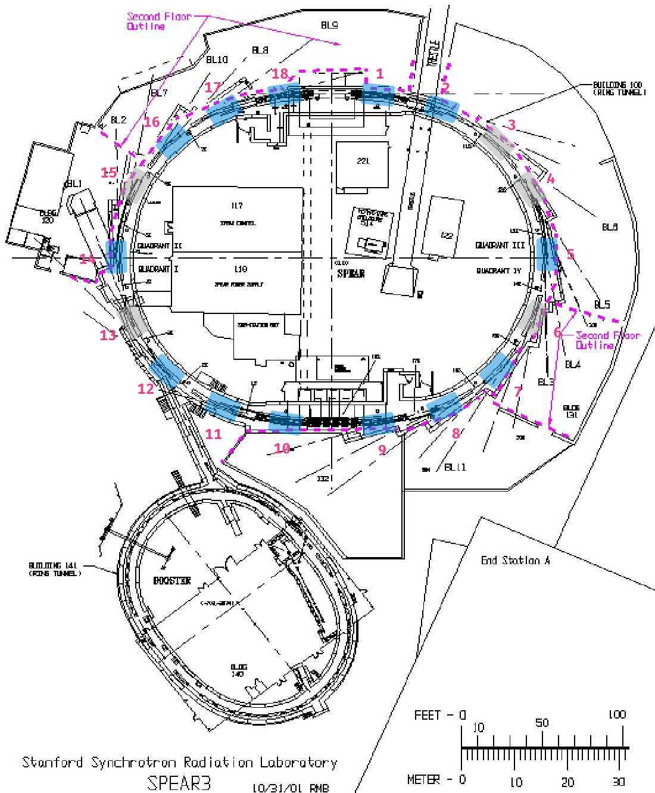

layout: true
name: blank

---

layout: true
name: cover
class: middle, left

---

layout: true
name: blank-backlog
background-image: url(images/background/iceberg-20.png)
background-position: bottom -3em right -2.5em
background-size: 15%

---

layout: true
name: cover-backlog
background-image: url(images/background/iceberg-20.png)
background-size: 50%

<!-- Beginning of the Slides -->

---

layout: true
template: cover

<!-- Title -->

---

name: title

# [.title[Teeport]](https://teeport.ml/tasks)
.my-n3[
]

## Break the Wall between the Optimization Algorithms and Problems
.py-4[
]

[Zhe](https://github.com/wenatuhs).highlight.sup[\*] [ZHANG](mailto:zhezhang@slac.stanford.edu)  
.text-muted[11/06/2020]

.footnote[
.highlight.mid[\\*] Call me *Jay* if you have difficulty pronouncing it
]

---

exclude: true

.left-5[
1. This is an inline integral: $\int_a^bf(x)dx$
2. More $x={a \over b}$ formulae.
]

.right-5[
Display formula:

$$e^{i\pi} + 1 = 0$$
]

---

layout: true
template: blank
name: motivation

# [Motivation](#index)

---

layout: true
template: motivation

## Optimizations in the accelerator field

---

.left-5[
Lots of optimization algorithm applications in the field


]

--

name: opt-acc

.right-5[
Even more optimization packages/platforms available

- [**PaGMO**](https://github.com/esa/pagmo2)/[**PyGMO**](https://github.com/esa/pygmo2) .badge.badge-secondary[c++/python]  
.text-muted.small[MOGA optimization package]
- [**pymoo**](https://pymoo.org/) .badge.badge-secondary[python]  
.text-muted.small[Another MOGA optimization package]
- [**PlatEMO**](https://github.com/BIMK/PlatEMO) .badge.badge-secondary[matlab]  
.text-muted.small[Collection of the latest MOGA algorithms/test suites]
- [**Ocelot optimizer**](https://github.com/ocelot-collab/optimizer) .badge.badge-secondary[python]  
.text-muted.small[Designed for accelerator machine interface]
- [**xopt**](https://github.com/ChristopherMayes/xopt) .badge.badge-secondary[python]  
.text-muted.small[Parallel optimization]
- [**...**](https://github.com/search?q=optimization+platform) .badge.badge-primary[500+]  
.text-muted.small[Optimization + platform on Github]
]

---

layout: true
template: motivation

## The wall

---

name: the-wall

.center[

]

---

count: false

.center[

]

---

count: false

.center[

]

---

count: false

.center[

]

---

count: false

.center[

]

---

count: false

.center[

]

---

name: the-wall-full
count: false

.center[

]

---

count: false

.center[

]

---

layout: true
template: motivation

## Get around the wall

---

name: get-around-the-wall

### RCDS: from `Matlab` to `C`.highlight.sup[\*]

.left-5[
.frame-4x5[.frame-i[
```matlab
function [x1,f1,nf]=powellmain(func,x0,step,Dmat0,tol,maxIt,flag_plot,maxEval)

if nargin <= 2 | isempty(x0)
    step = 0.02;
end
if nargin <= 3 | isempty(Dmat0)
    Dmat0 = eye(length(x0));
end
if nargin <= 4 | isempty(tol)
    tol = 1E-5;
end
if nargin <= 5 | isempty(maxIt)
    maxIt = 100;
end
if nargin <= 6 | isempty(flag_plot)
    flag_plot = 'noplot';
end
if nargin <= 7 | isempty(maxEval)
    maxEval = 1500;
end
Nvar = length(x0);

f0=func(x0);
nf=1;

%best solution so far
xm=x0;
fm=f0;

it=0;
Dmat = Dmat0;

global g_cnt
Npmin = 6;

while it < maxIt
    it = it+1;
    step = step/1.2;
    
    k=1;
    del=0;
    for ii=1:Nvar
        dv = Dmat(:,ii);
        [x1,f1,a1,a2,xflist,ndf] = bracketmin(func,xm,fm,dv,step,flag_plot);
        nf=nf+ndf;
        
        fprintf('iter %d, dir %d: begin\t%d, ',it,ii, g_cnt)
        [x1,f1,ndf] = linescan(func,x1,f1,dv,a1,a2,Npmin,xflist,flag_plot);
        fprintf('end\t%d : %f\n', g_cnt,f1)
        nf=nf+ndf;
        
        %direction with largest decrease
        if (fm - f1)*(1) > del,
            del=(fm - f1)*(1);
            k=ii;
            fprintf('iteration %d, var %d: del = %f updated\n',it, ii, del);
        end
        
        fm=f1;
        xm=x1;
    end
    
    xt = 2*xm-x0;
    ft = func(xt);
    nf = nf+1;
    
    if f0<=ft || 2*(f0-2*fm+ft)*((f0-fm-del)/(ft-f0))^2 >= del %|| norm(xm-x0)<0.01/sqrt(Nvar)
        fprintf('   , dir %d not replaced: %d, %d\n',k,f0<=ft, 2*(f0-2*fm+ft)*((f0-fm-del)/(ft-f0))^2 >= del )
    else
        ndv = (xm-x0)/norm(xm-x0);
        for jj=1:Nvar
            dotp(jj) = abs(ndv(:)'*Dmat(:,jj));
        end
        if max(dotp)<0.9
            if k < Nvar
                Dmat(:,k:Nvar-1)=Dmat(:,k+1:end);
            end
            Dmat(:,end)= ndv;
            
            %move to the mininum of the new direction
            dv = Dmat(:,end);
            [x1,f1,a1,a2,xflist,ndf] = bracketmin(func,xm,fm,dv,step,flag_plot);
            nf=nf+ndf;
            
            fprintf('iter %d, new dir %d: begin\t%d, ',it,k, g_cnt)
            [x1,f1,ndf] = linescan(func,x1,f1,dv,a1,a2,Npmin,xflist,flag_plot);
            fprintf('end\t%d : %f\n',g_cnt,f1)
            nf=nf+ndf;
            fm=f1;
            xm=x1;
        else
            fprintf('    , skipped new direction %d, max dot product %f\n',k, max(dotp));
            
            
        end
        
    end
    
    %termination
    if g_cnt>maxEval
        fprintf('terminated, reaching function evaluation limit: %d > %d\n',g_cnt, maxEval);
        break
    end
    if 2.0*abs(f0-fm) < tol*(abs(f0)+abs(fm)) & tol>0
        fprintf('terminated: f0=%4.2e\t, fm=%4.2e, f0-fm=%4.2e\n',f0, fm, f0-fm);
        break;
    end
    
    f0=fm;
    x0=xm;
end
```
]]]

.right-5[
.frame-4x5[.frame-i[
```c
long rcdsMin(double *yReturn, double *xBest, double *xGuess, double *dxGuess, double *xLowerLimit, double *xUpperLimit, double **dmat0, long dimensions, double target, /* will return if any value is <= this */
             double tolerance,                                                                                                                                          /* <0 means fractional, >0 means absolute */
             double (*func)(double *x, long *invalid), void (*report)(double ymin, double *xmin, long pass, long evals, long dims), long maxEvaluations,                /*maimum number of funcation evaluation */
             long maxPasses,                                                                                                                                            /*maximum number of iterations */
             double noise, double rcdsStep, unsigned long flags)
{
  long i, j, totalEvaluations = 0, inValid = 0, k, pass, Npmin = 6, direction;
  double *x0 = NULL; /*normalized xGuess */
  double *dv = NULL, del = 0, f0, step = 0.01, f1, fm, ft, a1, a2, tmp, norm, maxp = 0, tmpf, *tmpx = NULL;
  double *xm = NULL, *x1 = NULL, *xt = NULL, *ndv = NULL, *dotp = NULL, *x_value = NULL, *xmin = NULL, fmin;
  double *step_list = NULL, *f_list = NULL, step_init;
  long n_list;

  rcdsFlags = 0;
  if (rcdsStep > 0 && rcdsStep < 1)
    step = rcdsStep;

  if (dimensions <= 0)
    return (-3);
  DIMENSIONS = dimensions;

  if (flags & SIMPLEX_VERBOSE_LEVEL1)
    fprintf(stdout, "rcdsMin dimensions: %ld\n", dimensions);

  x0 = malloc(sizeof(*x0) * dimensions);
  tmpx = malloc(sizeof(*tmpx) * dimensions);
  /*normalize xGuess  to between 0 and 1; for step unification purpose */
  normalize_variables(xGuess, x0, xLowerLimit, xUpperLimit, dimensions);

  f0 = (*func)(xGuess, &inValid); /*note that the function evaluation still uses non-normalized */
  if (inValid)
    {
      f0 = DBL_MAX;
      fprintf(stderr, "error: initial guess is invalid in rcdsMin()\n");
      free(x0);
      free(tmpx);
      return (-3);
    }
  totalEvaluations++;
  if (!dmat0)
    {
      dmat0 = malloc(sizeof(*dmat0) * dimensions);
      for (i = 0; i < dimensions; i++)
        {
          dmat0[i] = calloc(dimensions, sizeof(**dmat0));
          for (j = 0; j < dimensions; j++)
            if (j == i)
              dmat0[i][j] = 1;
        }
    }
  if (dxGuess)
    {
      step = 0;
      for (i = 0; i < dimensions; i++)
        {
          if (xLowerLimit && xUpperLimit)
            {
              step += dxGuess[i] / (xUpperLimit[i] - xLowerLimit[i]);
            }
          else
            step += dxGuess[i];
        }
      step /= dimensions;
    }
  step = 0.01;
  /*best solution so far */
  xm = malloc(sizeof(*xm) * dimensions);
  xmin = malloc(sizeof(*xmin) * dimensions);
  memcpy(xm, x0, sizeof(*xm) * dimensions);
  memcpy(xmin, x0, sizeof(*xm) * dimensions);
  fmin = fm = f0;
  memcpy(xBest, xGuess, sizeof(*xBest) * dimensions);
  *yReturn = f0;
  if (f0 <= target)
    {
      if (flags & SIMPLEX_VERBOSE_LEVEL1)
        {
          fprintf(stdout, "rcdsMin: target value achieved in initial setup.\n");
        }
      if (report)
        (*report)(f0, xGuess, 0, 1, dimensions);
      free(tmpx);
      free(x0);
      free(xm);
      free(xmin);
      free_zarray_2d((void **)dmat0, dimensions, dimensions);
      return (totalEvaluations);
    }

  if (maxPasses <= 0)
    maxPasses = DEFAULT_MAXPASSES;

  x1 = tmalloc(sizeof(*x1) * dimensions);
  xt = tmalloc(sizeof(*xt) * dimensions);
  ndv = tmalloc(sizeof(*ndv) * dimensions);
  dotp = tmalloc(sizeof(*dotp) * dimensions);
  for (i = 0; i < dimensions; i++)
    dotp[i] = 0;

  if (!x_value)
    x_value = tmalloc(sizeof(*x_value) * dimensions);

  if (flags & SIMPLEX_VERBOSE_LEVEL1)
    {
      fprintf(stdout, "rcdsMin: starting conditions:\n");
      for (direction = 0; direction < dimensions; direction++)
        fprintf(stdout, "direction %ld: guess=%le \n", direction, xGuess[direction]);
      fprintf(stdout, "starting funcation value %le \n", f0);
    }
  pass = 0;
  while (pass < maxPasses && !(rcdsFlags & RCDS_ABORT))
    {
      step = step / 1.2;
      step_init = step;
      k = 0;
      del = 0;
      for (i = 0; !(rcdsFlags & RCDS_ABORT) && i < dimensions; i++)
        {
          dv = dmat0[i];
          if (flags & SIMPLEX_VERBOSE_LEVEL1)
            fprintf(stdout, "begin iteration %ld, var %ld, nf=%ld\n", pass + 1, i + 1, totalEvaluations);
          totalEvaluations += bracketmin(func, xm, fm, dv, xLowerLimit, xUpperLimit, dimensions, noise, step_init, &a1, &a2, &step_list, &f_list, &n_list, x1, &f1, xmin, &fmin);
          memcpy(tmpx, x1, sizeof(*tmpx) * dimensions);
          tmpf = f1;
          if (flags & SIMPLEX_VERBOSE_LEVEL1)
            fprintf(stdout, "\niter %ld, dir (var) %ld: begin linescan %ld\n", pass + 1, i + 1, totalEvaluations);
          if (rcdsFlags & RCDS_ABORT)
            break;
          totalEvaluations += linescan(func, tmpx, tmpf, dv, xLowerLimit, xUpperLimit, dimensions, a1, a2, Npmin, step_list, f_list, n_list, x1, &f1, xmin, &fmin);
          /*direction with largest decrease */
          if ((fm - f1) > del)
            {
              del = fm - f1;
              k = i;
              if (flags & SIMPLEX_VERBOSE_LEVEL1)
                fprintf(stdout, "iteration %ld, var %ld: del= %f updated", pass + 1, i + 1, del);
            }
          if (flags & SIMPLEX_VERBOSE_LEVEL1)
            fprintf(stdout, "iteration %ld, director %ld done, fm=%f, f1=%f\n", pass + 1, i + 1, fm, f1);

          fm = f1;
          memcpy(xm, x1, sizeof(*xm) * dimensions);
        }
      if (flags & SIMPLEX_VERBOSE_LEVEL1)
        fprintf(stderr, "\niteration %ld, fm=%f fmin=%f\n", pass + 1, fm, fmin);
      if (rcdsFlags & RCDS_ABORT)
        break;
      inValid = 0;
      for (i = 0; i < dimensions; i++)
        {
          xt[i] = 2 * xm[i] - x0[i];
          if (fabs(xt[i]) > 1)
            {
              inValid = 1;
              break;
            }
        }
      if (!inValid)
        {
          scale_variables(x_value, xt, xLowerLimit, xUpperLimit, dimensions);
          ft = (*func)(x_value, &inValid);
          totalEvaluations++;
        }
      if (inValid)
        ft = DBL_MAX;
      tmp = 2 * (f0 - 2 * fm + ft) * pow((f0 - fm - del) / (ft - f0), 2);
      if ((f0 <= ft) || tmp >= del)
        {
          if (flags & SIMPLEX_VERBOSE_LEVEL1)
            fprintf(stdout, "dir %ld not replaced, %d, %d\n", k, f0 <= ft, tmp >= del);
        }
      else
        {
          /*compute norm of xm - x0 */
          if (flags & SIMPLEX_VERBOSE_LEVEL1)
            fprintf(stdout, "compute dotp\n");
          norm = 0;
          for (i = 0; i < dimensions; i++)
            {
              norm += (xm[i] - x0[i]) * (xm[i] - x0[i]);
            }
          norm = pow(norm, 0.5);
          for (i = 0; i < dimensions; i++)
            ndv[i] = (xm[i] - x0[i]) / norm;
          maxp = 0;
          for (i = 0; i < dimensions; i++)
            {
              dv = dmat0[i];
              dotp[i] = 0;
              for (j = 0; j < dimensions; j++)
                dotp[i] += ndv[j] * dv[j];
              dotp[i] = fabs(dotp[i]);
              if (dotp[i] > maxp)
                maxp = dotp[i];
            }
          if (maxp < 0.9)
            {
              if (flags & SIMPLEX_VERBOSE_LEVEL1)
                fprintf(stdout, "max dot product <0.9, do bracketmin and linescan...\n");
              if (k < dimensions - 1)
                {
                  for (i = k; i < dimensions - 1; i++)
                    {
                      for (j = 0; j < dimensions; j++)
                        dmat0[i][j] = dmat0[i + 1][j];
                    }
                }
              for (j = 0; j < dimensions; j++)
                dmat0[dimensions - 1][j] = ndv[j];
              dv = dmat0[dimensions - 1];
              totalEvaluations += bracketmin(func, xm, fm, dv, xLowerLimit, xUpperLimit, dimensions, noise, step, &a1, &a2, &step_list, &f_list, &n_list, x1, &f1, xmin, &fmin);

              memcpy(tmpx, x1, sizeof(*tmpx) * dimensions);
              tmpf = f1;
              totalEvaluations += linescan(func, tmpx, tmpf, dv, xLowerLimit, xUpperLimit, dimensions, a1, a2, Npmin, step_list, f_list, n_list, x1, &f1, xmin, &fmin);
              memcpy(xm, x1, sizeof(*xm) * dimensions);
              fm = f1;
              if (flags & SIMPLEX_VERBOSE_LEVEL1)
                fprintf(stderr, "fm=%le \n", fm);
            }
          else
            {
              if (flags & SIMPLEX_VERBOSE_LEVEL1)
                fprintf(stdout, "   , skipped new direction %ld, max dot product %f\n", k, maxp);
            }
        }
      /*termination */
      if (totalEvaluations > maxEvaluations)
        {
          fprintf(stderr, "Terminated, reaching function evaluation limit %ld > %ld\n", totalEvaluations, maxEvaluations);
          break;
        }
      if (2.0 * fabs(f0 - fmin) < tolerance * (fabs(f0) + fabs(fmin)) && tolerance > 0)
        {
          if (flags & SIMPLEX_VERBOSE_LEVEL1)
            fprintf(stdout, "Reach tolerance, terminated, f0=%le, fmin=%le, f0-fmin=%le\n", f0, fmin, f0 - fmin);
          break;
        }
      if (fmin <= target)
        {
          if (flags & SIMPLEX_VERBOSE_LEVEL1)
            fprintf(stdout, "Reach target, terminated, fm=%le, target=%le\n", fm, target);
          break;
        }
      f0 = fm;
      memcpy(x0, xm, sizeof(*x0) * dimensions);
      pass++;
    }

  /*x1, f1 best solution */
  scale_variables(xBest, xmin, xLowerLimit, xUpperLimit, dimensions);
  *yReturn = fmin;

  free(x0);
  free(xm);
  free_zarray_2d((void **)dmat0, dimensions, dimensions);
  free(x1);
  free(xt);
  free(ndv);
  free(dotp);
  free(f_list);
  f_list = NULL;
  free(step_list);
  step_list = NULL;
  free(tmpx);
  free(x_value);
  return (totalEvaluations);
}
```
]]]

.footnote[
.highlight.mid[\*] Unpublished code © [2002 Hairong Shang](mailto:shang@anl.gov)
]

---

.left-5[
### The true NSGA-II.highlight.sup[\*]

.frame-4x5[.frame-i[
```matlab
function f  = genetic_operator(parent_chromosome, M, V, mu, mum, l_limit, u_limit)

[N,m] = size(parent_chromosome);

clear m
p = 1;
% Flags used to set if crossover and mutation were actually performed. 
was_crossover = 0;
was_mutation = 0;


for i = 1 : N
    % With 90 % probability perform crossover
    if rand(1) < 0.9
        % Initialize the children to be null vector.
        child_1 = [];
        child_2 = [];
        % Select the first parent
        parent_1 = round(N*rand(1));
        if parent_1 < 1
            parent_1 = 1;
        end
        % Select the second parent
        parent_2 = round(N*rand(1));
        if parent_2 < 1
            parent_2 = 1;
        end
        % Make sure both the parents are not the same. 
        while isequal(parent_chromosome(parent_1,:),parent_chromosome(parent_2,:))
            parent_2 = round(N*rand(1));
            if parent_2 < 1
                parent_2 = 1;
            end
        end
        % Get the chromosome information for each randomnly selected
        % parents
        parent_1 = parent_chromosome(parent_1,:);
        parent_2 = parent_chromosome(parent_2,:);
        % Perform corssover for each decision variable in the chromosome.
        for j = 1 : V
            % SBX (Simulated Binary Crossover).
            % For more information about SBX refer the enclosed pdf file.
            % Generate a random number
            u(j) = rand(1);
            if u(j) <= 0.5
                bq(j) = (2*u(j))^(1/(mu+1));
            else
                bq(j) = (1/(2*(1 - u(j))))^(1/(mu+1));
            end
*           bq(j) = bq(j)*(-1)^randi([0,1]);
            % Generate the jth element of first child
            child_1(j) = ...
                0.5*(((1 + bq(j))*parent_1(j)) + (1 - bq(j))*parent_2(j));
            % Generate the jth element of second child
            child_2(j) = ...
                0.5*(((1 - bq(j))*parent_1(j)) + (1 + bq(j))*parent_2(j));
            % Make sure that the generated element is within the specified
            % decision space else set it to the appropriate extrema.
            if child_1(j) > u_limit(j)
                child_1(j) = u_limit(j);
            elseif child_1(j) < l_limit(j)
                child_1(j) = l_limit(j);
            end
            if child_2(j) > u_limit(j)
                child_2(j) = u_limit(j);
            elseif child_2(j) < l_limit(j)
                child_2(j) = l_limit(j);
            end
        end
        % Evaluate the objective function for the offsprings and as before
        % concatenate the offspring chromosome with objective value.
        child_1(:,V + 1: M + V) = evaluate_objective(child_1, M, V);
        child_2(:,V + 1: M + V) = evaluate_objective(child_2, M, V);
        % Set the crossover flag. When crossover is performed two children
        % are generate, while when mutation is performed only only child is
        % generated.
        was_crossover = 1;
        was_mutation = 0;
    % With 10 % probability perform mutation. Mutation is based on
    % polynomial mutation. 
    else
        % Select at random the parent.
        parent_3 = round(N*rand(1));
        if parent_3 < 1
            parent_3 = 1;
        end
        % Get the chromosome information for the randomnly selected parent.
        child_3 = parent_chromosome(parent_3,:);
        % Perform mutation on eact element of the selected parent.
        for j = 1 : V
           r(j) = rand(1);
           if r(j) < 0.5
               delta(j) = (2*r(j))^(1/(mum+1)) - 1;
           else
               delta(j) = 1 - (2*(1 - r(j)))^(1/(mum+1));
           end
           % Generate the corresponding child element.
           child_3(j) = child_3(j) + delta(j);
           % Make sure that the generated element is within the decision
           % space.
           if child_3(j) > u_limit(j)
               child_3(j) = u_limit(j);
           elseif child_3(j) < l_limit(j)
               child_3(j) = l_limit(j);
           end
        end
        % Evaluate the objective function for the offspring and as before
        % concatenate the offspring chromosome with objective value.    
        child_3(:,V + 1: M + V) = evaluate_objective(child_3, M, V);
        % Set the mutation flag
        was_mutation = 1;
        was_crossover = 0;
    end
    % Keep proper count and appropriately fill the child variable with all
    % the generated children for the particular generation.
    if was_crossover
        child(p,:) = child_1;
        child(p+1,:) = child_2;
        was_cossover = 0;
        p = p + 2;
    elseif was_mutation
        child(p,:) = child_3(1,1 : M + V);
        was_mutation = 0;
        p = p + 1;
    end
end
f = child;
```
]]]

.right[

]

.footnote[
.highlight.mid[\*] [Minghao Song](mailto:mhsong@slac.stanford.edu) figured out this one-liner solution
]

---

count: false

### The true NSGA-II.highlight.sup[\*]

.left-5[

.frame-4x5[.frame-i[
```matlab
function f  = genetic_operator(parent_chromosome, M, V, mu, mum, l_limit, u_limit)

[N,m] = size(parent_chromosome);

clear m
p = 1;
% Flags used to set if crossover and mutation were actually performed. 
was_crossover = 0;
was_mutation = 0;


for i = 1 : N
    % With 90 % probability perform crossover
    if rand(1) < 0.9
        % Initialize the children to be null vector.
        child_1 = [];
        child_2 = [];
        % Select the first parent
        parent_1 = round(N*rand(1));
        if parent_1 < 1
            parent_1 = 1;
        end
        % Select the second parent
        parent_2 = round(N*rand(1));
        if parent_2 < 1
            parent_2 = 1;
        end
        % Make sure both the parents are not the same. 
        while isequal(parent_chromosome(parent_1,:),parent_chromosome(parent_2,:))
            parent_2 = round(N*rand(1));
            if parent_2 < 1
                parent_2 = 1;
            end
        end
        % Get the chromosome information for each randomnly selected
        % parents
        parent_1 = parent_chromosome(parent_1,:);
        parent_2 = parent_chromosome(parent_2,:);
        % Perform corssover for each decision variable in the chromosome.
        for j = 1 : V
            % SBX (Simulated Binary Crossover).
            % For more information about SBX refer the enclosed pdf file.
            % Generate a random number
            u(j) = rand(1);
            if u(j) <= 0.5
                bq(j) = (2*u(j))^(1/(mu+1));
            else
                bq(j) = (1/(2*(1 - u(j))))^(1/(mu+1));
            end
*           bq(j) = bq(j)*(-1)^randi([0,1]);
            % Generate the jth element of first child
            child_1(j) = ...
                0.5*(((1 + bq(j))*parent_1(j)) + (1 - bq(j))*parent_2(j));
            % Generate the jth element of second child
            child_2(j) = ...
                0.5*(((1 - bq(j))*parent_1(j)) + (1 + bq(j))*parent_2(j));
            % Make sure that the generated element is within the specified
            % decision space else set it to the appropriate extrema.
            if child_1(j) > u_limit(j)
                child_1(j) = u_limit(j);
            elseif child_1(j) < l_limit(j)
                child_1(j) = l_limit(j);
            end
            if child_2(j) > u_limit(j)
                child_2(j) = u_limit(j);
            elseif child_2(j) < l_limit(j)
                child_2(j) = l_limit(j);
            end
        end
        % Evaluate the objective function for the offsprings and as before
        % concatenate the offspring chromosome with objective value.
        child_1(:,V + 1: M + V) = evaluate_objective(child_1, M, V);
        child_2(:,V + 1: M + V) = evaluate_objective(child_2, M, V);
        % Set the crossover flag. When crossover is performed two children
        % are generate, while when mutation is performed only only child is
        % generated.
        was_crossover = 1;
        was_mutation = 0;
    % With 10 % probability perform mutation. Mutation is based on
    % polynomial mutation. 
    else
        % Select at random the parent.
        parent_3 = round(N*rand(1));
        if parent_3 < 1
            parent_3 = 1;
        end
        % Get the chromosome information for the randomnly selected parent.
        child_3 = parent_chromosome(parent_3,:);
        % Perform mutation on eact element of the selected parent.
        for j = 1 : V
           r(j) = rand(1);
           if r(j) < 0.5
               delta(j) = (2*r(j))^(1/(mum+1)) - 1;
           else
               delta(j) = 1 - (2*(1 - r(j)))^(1/(mum+1));
           end
           % Generate the corresponding child element.
           child_3(j) = child_3(j) + delta(j);
           % Make sure that the generated element is within the decision
           % space.
           if child_3(j) > u_limit(j)
               child_3(j) = u_limit(j);
           elseif child_3(j) < l_limit(j)
               child_3(j) = l_limit(j);
           end
        end
        % Evaluate the objective function for the offspring and as before
        % concatenate the offspring chromosome with objective value.    
        child_3(:,V + 1: M + V) = evaluate_objective(child_3, M, V);
        % Set the mutation flag
        was_mutation = 1;
        was_crossover = 0;
    end
    % Keep proper count and appropriately fill the child variable with all
    % the generated children for the particular generation.
    if was_crossover
        child(p,:) = child_1;
        child(p+1,:) = child_2;
        was_cossover = 0;
        p = p + 2;
    elseif was_mutation
        child(p,:) = child_3(1,1 : M + V);
        was_mutation = 0;
        p = p + 1;
    end
end
f = child;
```
]]]

.right[

]

.footnote[
.highlight.mid[\*] [Minghao Song](mailto:mhsong@slac.stanford.edu) figured out this one-liner solution
]

---

count: false

### The true NSGA-II.highlight.sup[\*]


.footnote[
.highlight.mid[\*] [Minghao Song](mailto:mhsong@slac.stanford.edu) figured out this one-liner solution
]

---

layout: true
template: blank
name: teeport-basics

# [Teeport 101](#index)

---

name: naming

## Naming

.highlight[**Teeport**] .mono[===] .highlight[**T**]ask-based .highlight[**e**]xtensible .highlight[**e**]mbeddable .highlight[**p**]latform for .highlight[**o**]ptimization and .highlight[**r**]eal-time .highlight[**t**]esting

--

name: principles

## Design principles

.left-5[
- .highlight[Minimize] the effort of the integration
    - Mininal APIs
- .highlight[Embeddable] to the existed workflow
    - Complement one another
- .highlight[Ensure] the data safety
    - Never lose the precious data, under *any* circumstances
]

.right-5[

]

---

name: concepts

## Concepts

.left-5[
### Evaluator

An implementation of a optimization problem. Usually can be abstracted as a function:
```python
Y = evaluate(X, configs)
```

The `configs` variable is the configuration of the problem, say:
```python
configs = {
    'noise_level': 0.1, # emulate the experimental env
    'wall_time': 1, # emulate the experimental env
    ...
}
```
]

.right-5[
### Optimizer

An implementation of an optimization algorithm:
```python
x_best = optimize(evaluate, configs)
```

The `evaluate` variable is the target function to be optimized:
```python
Y = evaluate(X)
```

An example of `configs`:
```python
configs = {
    'D': 8, # dimension of the problem to be optimized
    'N': 300, # maximum iterations
    ...
}
```
]

---

count: false

## Concepts

.left-5[
### Processor

A function that processes data and return the processed result:
```python
result = process(data, configs)
```

An example of `configs`:
```python
configs = {
    'return_grad': False,
    'ard': True,
    ...
}
```
]

---

layout: true
template: blank
name: api-design

# [API Design](#index)

---

name: use-evaluator

.left-5[
## For algorithm developers

- .current[Use an evaluator]  
`use_evaluator(id: string)`
]

.right-5[
### Usage

```python
from teeport import Teeport

# Connect to the platform
teeport = Teeport('ws://localhost:8080/')

# Use the evaluator
*evaluate = teeport.use_evaluator('c4oiY1_oe')

X = np.random.rand(30, 8)
Y = evaluate(X)
```
]

---

name: run-optimizer
count: false

.left-5[
## For algorithm developers

- Use an evaluator  
`use_evaluator(id: string)`
- .current[Ship an optimizer]  
`run_optimizer(optimize: function)`
]

.right-5[
### Usage

```python
from teeport import Teeport

# Connect to the platform
teeport = Teeport('ws://localhost:8080/')

# Ship the algorithm
*teeport.run_optimizer(optimize)
# optimizer id: vRpl0gFr_
```

### The `optimize` function
```python
def optimize(evaluate):
    # Y = evaluate(X)
    #
    # X and Y are 2D arrays
    # shape of X: (N, D)
    # shape of Y: (N, O)
    # where N the number of points
    # D the dimension of the decision vector
    # O the dimension of the objective vector
    ...
```
]

---

name: use-optimizer
count: false

.left-5[
## For algorithm developers

- Use an evaluator  
`use_evaluator(id: string)`
- Ship an optimizer  
`run_optimizer(optimize: function)`

## For algorithm users

- .current[Use an optimizer]  
`use_optimizer(id: string)`
]

.right-5[
### Usage

```python
from teeport import Teeport

# Connect to the platform
teeport = Teeport('ws://localhost:8080/')

# Use the optimizer
*optimize = teeport.use_optimizer('isBiBX4Rv')

optimize(evaluate)
```

### The `evaluate` function
```python
def evaluate(X):
    # X and Y are 2D arrays
    # shape of X: (N, D)
    # shape of Y: (N, O)
    # where N the number of points
    # D the dimension of the decision vector
    # O the dimension of the objective vector
    ...
    return Y
```
]

---

name: run-evaluator
count: false

.left-5[
## For algorithm developers

- Use an evaluator  
`use_evaluator(id: string)`
- Ship an optimizer  
`run_optimizer(optimize: function)`

## For algorithm users

- Use an optimizer  
`use_optimizer(id: string)`
- .current[Ship an evaluator]  
`run_evaluator(evaluate: function)`
]

.right-5[
### Usage

```python
from teeport import Teeport

# Connect to the platform
teeport = Teeport('ws://localhost:8080/')

# Ship the problem
*teeport.run_evaluator(evaluate)
# evaluator id: S6QV_KO-s
```

### The `evaluate` function
```python
def evaluate(X):
    # X and Y are 2D arrays
    # shape of X: (N, D)
    # shape of Y: (N, O)
    # where N the number of points
    # D the dimension of the decision vector
    # O the dimension of the objective vector
    ...
    return Y
```
]

---

name: use-processor
count: false

.left-5[
## For algorithm developers

- Use an evaluator  
`use_evaluator(id: string)`
- Ship an optimizer  
`run_optimizer(optimize: function)`

## For algorithm users

- Use an optimizer  
`use_optimizer(id: string)`
- Ship an evaluator  
`run_evaluator(evaluate: function)`

## For both
- .current[Use a processor]  
`use_processor(id: string)`
]

.right-5[
### Usage

```python
from teeport import Teeport

# Connect to the platform
teeport = Teeport('ws://localhost:8080/')

# Use the processor
*process = teeport.use_processor('BLBaVJxOy')

result = process(data)
```
]

---

name: run-processor
count: false

.left-5[
## For algorithm developers

- Use an evaluator  
`use_evaluator(id: string)`
- Ship an optimizer  
`run_optimizer(optimize: function)`

## For algorithm users

- Use an optimizer  
`use_optimizer(id: string)`
- Ship an evaluator  
`run_evaluator(evaluate: function)`

## For both
- Use a processor  
`use_processor(id: string)`
- .current[Ship a processor]  
`run_processor(process: function)`
]

.right-5[
### Usage

```python
from teeport import Teeport

# Connect to the platform
teeport = Teeport('ws://localhost:8080/')

# Ship the processor
*teeport.run_processor(process)
# processor id: BLBaVJxOy
```

### The `process` function
```python
def process(data):
    # data can be any serializable object
    # result can be any serializable object
    ...
    return result
```
]

---

layout: true
template: blank
name: teeport-basics-plus

# [Teeport 101+](#index)

---

## There is a Tee in Teeport

<!-- .highlight[**Teeport**] connects the *optimizer* and the *evaluator*.  
But .highlight[**Teeport**] is more than that. -->

.center[

]

--

<div class='bold' style='position: absolute; top: 70%; left: 33%'>
    Optimizer
</div>
<div class='bold' style='position: absolute; top: 70%; left: 59%'>
    Evaluator
</div>

--

<div class='bold' style='position: absolute; top: 83%; left: 47%'>
    Monitor
</div>

--

<div class='bold highlight' style='position: absolute; top: 31%; left: 47%'>
    Control
</div>

---

name: concepts-cont

## Concepts+

.left-5[
### Monitor

A visualization of the data flow between the [**optimizer**](#concepts) and the [**evaluator**](#concepts) that catches some feature of the data.

Examples:

]

---

layout: true
template: blank
name: frontend

# [Frontend of Teeport](#index)

---

name: desktop

<div class='w-100 overflow-hidden' style='height: 512px'>
    <iframe
        width='125%' height='640' frameborder='0'
        style='-webkit-transform: scale(0.8);-webkit-transform-origin: 0 0;'
        src='https://teeport.ml/tasks'
    ></iframe>
</div>

---

name: mobile
count: false

.center[

]

<div class='overflow-hidden'
    style='position: absolute; width: 207px; height: 368px; left: 501px; top: 152px;'
>
    <iframe
        width='414' height='736' frameborder='0'
        style='-webkit-transform: scale(0.5);-webkit-transform-origin: 0 0;'
        src='https://teeport.ml/tasks'
    >
    </iframe>
</div>

---

layout: true
template: blank
name: api-design-cont

# [API Design+](#index)

---

name: monitor-eval

.left-5[
## For algorithm developers

- .current[Monitor an evaluator]  
`use_evaluator(evaluate: function)`
]

.right-5[
### Usage

```python
from teeport import Teeport

# Connect to the platform
teeport = Teeport('ws://localhost:8080/')

# Monitor the problem
*evaluate = teeport.use_evaluator(evaluate)

X = np.random.rand(30, 8)
Y = evaluate(X)
```

### The `evaluate` function
```python
def evaluate(X):
    # X and Y are 2D arrays
    # shape of X: (N, D)
    # shape of Y: (N, O)
    # where N the number of points
    # D the dimension of the decision vector
    # O the dimension of the objective vector
    ...
    return Y
```
]

---

count: false

name: monitor-opt

.left-5[
## For algorithm developers

- Monitor an evaluator  
`use_evaluator(evaluate: function)`
- .current[Monitor an optimizer]  
`use_optimizer(optimize: function)`
]

.right-5[
### Usage

```python
from teeport import Teeport

# Connect to the platform
teeport = Teeport('ws://localhost:8080/')

# Monitor the algorithm
*optimize = teeport.use_optimizer(optimize)

optimize(evaluate)
```

### The `optimize` function
```python
def optimize(evaluate):
    # Y = evaluate(X)
    #
    # X and Y are 2D arrays
    # shape of X: (N, D)
    # shape of Y: (N, O)
    # where N the number of points
    # D the dimension of the decision vector
    # O the dimension of the objective vector
    ...
```
]

---

layout: true
template: blank
name: applications

# [Applications](#index)

---

layout: true
template: applications

## SPEAR3 beam loss rate remote optimization

---

name: applications-lossrate

.left-5[
.center[

]]

.right-5[
[**Lossrate Exp Evaluator**](https://github.com/SPEAR3-ML/lossrate-exp-evaluator) .badge.badge-secondary[matlab]
.mb-n3[
]
.text-muted.small[The SPEAR3 beam loss rate evaluator for online
optimization]

.frame-3x4[.frame-i[
```matlab
function lossrate = getlossrate(duration)
    injpv = getpv('SPEAR:InjectState');
    if injpv>0
        time_lastInj = now;
        while getpv('SPEAR:InjectState')
            pause(2.0);
            time_lastInj = now;
        end
    end
    while (now-time_lastInj)*3600*24 < duration+5.0 %seconds
        pause(0.5);
    end

    duration = ceil(duration);

    st = now;
    cur0 = getdcct;
    while (now-st)*3600*24<duration
        pause(0.1);
    end
    cur1 = getdcct;
    lossrate = -(cur1-cur0)*60./duration;
end

function lossrate_evaluator()
    % change to the directory that contains this file
    cd(fileparts(which(mfilename)));
    
    % integrate into the platform
    addTeeportPath; % just in case
*   teeport = Teeport('ws://lambda-sp3:8090/');
*   evaluatorId = teeport.runEvaluator(@evaluate);
    fprintf('evaluatorId: %s\n', evaluatorId);
    
    % create the clean up object
    cleanupObj = onCleanup(@()cleanup(teeport));
    pause(); % prevent the function from completing
end
```
]]]

---

count: false

.left-5[
.center[

]]

.right-5[
MG-GPO vs PSO.highlight.sup[\*]

]

.footnote[
.highlight.mid[\*] PSO .mono[===] Particle Swarm Optimization
]

---

layout: true
template: applications

## Enhance MG-GPO with GPy

---

name: applications-gpy

.left-5[

]

.right-5[
GPy side
.my-n2[
]

.frame-1x3[.frame-i[
```python
# opt/processors/gpt_predictor.py
def process(X, configs=None):
    X0 = np.array(X[0][0])
    Y0 = np.array(X[0][1])
    X1 = np.array(X[1])
    
    Y0_mean = np.mean(Y0, axis=0)
    _Y0 = Y0 - Y0_mean
    
    predict = model(X0, _Y0, configs)
    _Y1_mu, Y1_sigma, Y1_mu_grad, Y1_sigma_grad = predict(X1)
    Y1_mu = _Y1_mu + Y0_mean
    
    if Y1_mu_grad is None:
        P = [Y1_mu.tolist(), Y1_sigma.tolist()]
    else:
        P = [Y1_mu.tolist(), Y1_sigma.tolist(), Y1_mu_grad.tolist(), Y1_sigma_grad.tolist()]
    return P

# run_gpy_predictor.py
import numpy as np
import nest_asyncio
nest_asyncio.apply()
import asyncio
from functools import partial

from teeport import Teeport
from opt.processors.gpy_predictor import process

teeport = Teeport('ws://lambda-sp3:8090/')
*teeport.run_processor(partial(process, configs={}), 'GPy Predictor')
print('processor is running...')

loop = asyncio.get_event_loop()
loop.run_until_complete(teeport.processors[0].task)
```
]]

MG-GPO side
.my-n2[
]

.frame-1x3[.frame-i[
```matlab
%% Run
if useTeeport ~= 0
    % Read the platform settings
    fid = fopen('.teeport');
    url = fgetl(fid);
    if url == -1
        fclose(fid);
        error('Cannot read the url of the platform.')
    end
    processorId = fgetl(fid);
    if processorId == -1
        fclose(fid);
        error('Cannot read the id of the GPy processor on the platform.')
    end
    fclose(fid);
    
    % Connect to the platform
    teeport = Teeport(url);
    evaluate = teeport.useEvaluator(problem);
*   predict = teeport.useProcessor(processorId);
    
    gbest = MGGPO(evaluate,predict,Npop,Ngen,Nobj,Nvar);
    teeport.cleanUp(); % disconnect from the platform
else
    addpath GP;
    evaluate = problem;
    predict = @GP_predict;
    
    gbest = MGGPO(evaluate,predict,Npop,Ngen,Nobj,Nvar);
end
```
]]]

---

layout: true
template: applications

## Extend the ability of Ocelot

---

name: applications-ocelot

.center[

]

---

count: false

.center[

]

---

exclude: true

## Teeport features summary

.left-5[
### Using just the packages
- Minimal effort of integration
- Minimal interface to access an .highlight[evaluator]/.highlight[optimizer]
- Enable the developer to use packages written in any programing languages

___

- Break the wall between the .highlight[evaluator] and the .highlight[optimizer]
- Fast switch between .highlight[evaluator]/.highlight[optimizer]

___

- Completely decouple the .highlight[evaluator] and the .highlight[optimizer]
- Once develeped, use everywhere
- Easy to extend, one package for each language and that's all
- Work well with the existing platforms that collect lots of algorithms/test suites
]

--

exclude: true

.right-5[
### Using the frontend
- Monitoring
- Control
- Benchmarking
- Exporting .text-muted[(so you're not locked in)]
- Population/individual evaluation

___

- `Time travel`
]

---

exclude: true
name: time-travel

## About `time travel`

---

exclude: true
name: data-safety

## Data safety

---

layout: true
template: blank
name: summary

# [Summary](#index)

---

name: repos

.left-5[
## Features

### Teeport w/o GUI

- Connect optimizers, evaluators and processors, *effortlessly*
    - Support both <abbr title='Single-objective Problem'>SOP</abbr>s and <abbr title='Multi-objective Problem'>MOP</abbr>s
- Resume/.text-muted[recover] optimization from break-point

### Teeport w/ GUI

- Control
- Monitor
- Export
- Benchmark
- .text-muted[Hyper-parameter tuning]
- .text-muted[Time traveling]
]

.right-5[
## Repositories

- [**Teeport Backend**](https://github.com/SPEAR3-ML/teeport-backend) .badge.badge-secondary[javascript/docker]  
.text-muted.small[Backend for the Teeport platform
]
- [**Teeport Frontend**](https://github.com/SPEAR3-ML/teeport-frontend) .badge.badge-secondary[javascript/html/css/docker]  
.text-muted.small[Frontend for the Teeport platform
]
- [**Teeport Client for Python**](https://github.com/SPEAR3-ML/teeport-client-python) .badge.badge-secondary[python]  
.text-muted.small[Python client of the Teeport platform
]
- [**Teeport Client for Matlab**](https://github.com/SPEAR3-ML/teeport-client-matlab) .badge.badge-secondary[matlab]  
.text-muted.small[Matlab client of the Teeport platform
]

___

- [**SPEAR3 Opt Toolbox**](https://github.com/SPEAR3-ML/spear3-opt-pkg) .badge.badge-secondary[python]  
.text-muted.small[SPEAR3 online optimization toolbox
]
- [**Teeport Plugins**](https://github.com/SPEAR3-ML/teeport-plugins) .badge.badge-secondary[python]  
.text-muted.small[Optimizers, evaluators and processors for
the Teeport platform]
]

---

layout: true
template: blank

# [Acknowledgements](#index)

---

name: acknowledgements

- [**Xiaobiao Huang**](mailto:huangxb@anl.gov) .badge.badge-primary[sponsor]  
.text-muted.small[For the support.highlight.sup[1, 2, 3] and many good advices
]
- [**Minghao Song**](mailto:mhsong@slac.stanford.edu) .badge.badge-primary[user#1]  
.text-muted.small[For the alpha-stage testing/debugging and the helpful feedbacks  
Also for the contribution to the matlab Teeport plugin
]
- [**Adi Hanuka**](mailto:adiha@slac.stanford.edu) .badge.badge-primary[advocate]  
.text-muted.small[For the very helpful discussions and advices  
Also for the kind advertising for Teeport!
]
- [**Hugo Slepicka**](mailto:slepicka@slac.stanford.edu) .badge.badge-primary[user#2]  
.text-muted.small[For the beta-stage testing and the guidelines for the Ocelot integration  
Also for the kind support for Teeport!
]
- [**Hairong Shang**](mailto:shang@anl.gov) .badge.badge-primary[user#3]  
.text-muted.small[For the beta-stage testing and providing code used in these slides   
Also for the kind support for Teeport!
]

.footnote[
.highlight[1.] U.S. Department of Energy, Office of Science, Office of Basic Energy Sciences, Contract No. *DE-AC02-76SF00515*  
.highlight[2.] U.S. Department of Energy, Office of Science, Office of Basic Energy Sciences, *FWP 2018-SLAC-100469*  
.highlight[3.] U.S. Department of Energy, Computing Science, Office of Advanced Scientific Computing Research, *FWP 2018-SLAC-100469ASCR*
]

---

template: cover
name: thanks

# Thanks.text-primary[!]
.my-n3[
]

## [Questions and comments](#index) are welcome

---

template: blank
name: index
count: false

# [Index](#thanks)

.left-5[
## Outlines

### [Motivation](#opt-acc)
- [Optimizations in the accelerator field](#opt-acc)
- [The wall](#the-wall-full)

### [Teeport](#principles)
- [Design principles](#principles)
- [Concepts](#concepts) `&` [Concepts+](#concepts-cont)
- [API](#run-processor) `&` [API+](#monitor-opt)
- [Desktop](#desktop) `&` [Mobile](#mobile)
- [Repositories](#repos)

### [Applications](#applications-lossrate)
- [SPEAR3 beam loss rate remote optimization](#applications-lossrate)
- [Enhance MG-GPO with GPy](#applications-gpy)
- [Extend the ability of Ocelot](#applications-ocelot)
]

.right-5[
## Backlog

<!-- ### [FAQ](#cons-prob)
- [Deal with constrained/safety search problems?](#cons-prob)
- [Work in the LCLS control room?](#no-network)
- [Pass the Pareto front to the evaluator?](#calc-igd)
- [Carry more information (evaluator side)?](#carry-more)
- [Monitor more properties (optimizer side)?](#monitor-feature) -->

### [Teeport+](#teeport-arch)
- [Architecture](#teeport-arch)
- [Key design](#key-design)

### [Misc](#about)
- [How did you make these slides?](#about)
]

---

layout: true
template: blank-backlog
name: faq

# [FAQ](#index)

---

name: cons-prob
count: false

## Constrained problems in Teeport

.left-5[
### General constrains

$$C_1(\mathbf{x}) \le 0$$
$$C_2(\mathbf{x}) \le 0$$
$$\cdots$$
$$C_k(\mathbf{x}) \le 0$$

### Evaluators/processors composition

$$C_1(\mathbf{x})$$

### Deal in the optimizer

$$C_1(\mathbf{x})$$
]

.right-5[
]

---

name: no-network
count: false

## What if no network access

---

name: calc-igd
count: false

## How to pass the Pareto front

---

name: carry-more
count: false

## How to carry more information

---

name: monitor-feature
count: false

## Monitor some other properties

---

layout: true
template: blank-backlog
name: b-teeport

# [Teeport](#index)

---

layout: true
template: b-teeport
name: b-teeport-arch

## Architecture

---

layout: true
template: b-teeport-arch

.left-5[
.highlight[**Teeport**] at its core: a `RTC` system between different type of clients
- An optimization process is a .highlight[task]
- A .highlight[task] must has an .highlight[optimizer] client and an .highlight[evaluator] client
    - The .highlight[optimizer] client holds an `optimize` function
    - The .highlight[evaluator] client holds an `evaluate` function
]

---

name: teeport-arch
count: false

.right-5[
### General case
.frame-9x10[.frame-i[
.center[

]]]]

---

count: false

.right-5[
### `use_evaluator(id: string)` case
.frame-9x10[.frame-i[
.center[

]]]]

---

count: false

.right-5[
### `use_optimizer(id: string)` case
.frame-9x10[.frame-i[
.center[

]]]]

---

count: false

.right-5[
### `use_evaluator(evaluate: function)` and `use_optimizer(optimize: function)` cases

.center[

]]

---

layout: true
template: b-teeport-arch

.left-5[
.highlight[**Teeport**] at its core: a `RTC` system between different type of clients
- An optimization process is a .highlight[task]
- A .highlight[task] must has an .highlight[optimizer] client and an .highlight[evaluator] client
    - The .highlight[optimizer] client holds an `optimize` function
    - The .highlight[evaluator] client holds an `evaluate` function
- Clients communicate with each other by the `websocket` protocol
]

---

count: false

.right-5[
.frame-1x1[.frame-i[

]]]

---

name: teeport-signal-seq
count: false

.right-5[
.frame-1x1[.frame-i[
<div class='mermaid'>
sequenceDiagram
    Note over Wildcard: Get optimizer/evaluator id
    Wildcard->>+Server: init task
    Server->>Server: create task in memory
    par
        Server->>+Monitor: start task
        Monitor->>-Monitor: create task in memory
    and
        Server->>-Optimizer: start task
    end
    loop optimization
        activate Optimizer
        Optimizer->>Optimizer: generate next X
        Optimizer->>+Server: evaluate X
        deactivate Optimizer
        Server->>Server: add X to pending queue
        Server->>-Evaluator: evaluate X
        activate Evaluator
        Evaluator->>Evaluator: calculate Y = f(X)
        Evaluator->>+Server: evaluated Y
        deactivate Evaluator
        Server->>Server: remove X from pending queue
        Server->>Server: add [X, Y] to history list
        par
            Server->>+Monitor: evaluated Y
            Monitor->>-Monitor: add Y to history list
        and
            Server->>-Optimizer: evaluated Y
        end
    end
    Note over Optimizer: Meet termination condition
    Optimizer->>+Server: task completed
    Server->>Server: dump task to DB
    Server->>-Monitor: task completed
</div>
]]]

---

template: b-teeport-arch
count: false

.left-5[
### The client structure

.frame-9x10[.frame-i[
```js
const clientDef = () => {
  return {
    name: null,
    type: null,
*   classId: null, // like NSGA-II and ZDT-2
    private: false,
    taskId: null,
    connectedAt: null,
    configs: {},
    descr: null,
  }
}
```
]]]

.right-5[
### The task structure

.frame-9x10[.frame-i[
```js
const taskDef = () => {
  return {
    name: null,
    createdAt: null,
    startedAt: null,
    stoppedAt: null,
    archivedAt: null,
    status: 'init',
    optimizerId: null, // optimizer socket id
*   algorithmId: null, // optimizer id, like NSGA-II
    evaluatorId: null, // evaluator socket id
*   problemId: null, // evaluator id, like ZDT-2
    pending: [],
    history: [],
    configs: {},
    descr: null,
  }
}
```
]]]

---

template: b-teeport-arch
count: false

.left-5[
### The client structure

.frame-9x10[.frame-i[
```js
const clientDef = () => {
  return {
    name: null,
    type: null,
    classId: null, // like NSGA-II and ZDT-2
    private: false,
    taskId: null,
    connectedAt: null,
    configs: {},
    descr: null,
  }
}
```
]]]

.right-5[
### The task structure

.frame-9x10[.frame-i[
```js
const taskDef = () => {
  return {
    name: null,
    createdAt: null,
    startedAt: null,
    stoppedAt: null,
    archivedAt: null,
    status: 'init',
    optimizerId: null, // optimizer socket id
    algorithmId: null, // optimizer id, like NSGA-II
    evaluatorId: null, // evaluator socket id
    problemId: null, // evaluator id, like ZDT-2
*   pending: [],
*   history: [],
    configs: {},
    descr: null,
  }
}
```
]]]

---

layout: true
template: b-teeport

## Key design

---

name: key-design
count: false

.left-5[
### Multi-threading in clients

For the `use_evaluator(id: string)` API, what's the corresponding `optimize` function?
- The `optimize` function has to be bound to the .highlight[optimizer] client and keeps running all the time
- It needs to "generate" an `X` when the user calls `evaluate(X)`
]

.right-5[
.frame-9x10[.frame-i[
.center[

]]]]

---

name: multi-thread-seq
count: false

.left-5[
### Multi-threading in clients

.frame-9x10[.frame-i[
<div class='mermaid'>
sequenceDiagram
    participant H as Human
    participant E as Evaluate Func
    participant O as Optimize Func
    participant S as Socket Thread

    H->>E: first call with X0
    E->>O: create with X0
    par
        E->>E: start eval thread
        activate E
        Note over E: wait for Y0
    and
        O->>+S: evaluate X0
    end
    Note over S: get Y0 from server
    S->>-O: evaluated Y0
    O->>E: set result Y0
    deactivate E
    par
        O->>O: start opt thread
        activate O
        Note over O: wait for X
    and
        E->>H: return Y0
    end

    loop
        H->>E: call with X
        E->>O: set result X
        deactivate O
        par
            E->>+E: start eval thread
            Note over E: wait for Y
        and
            O->>+S: evaluate X
        end
        Note over S: get Y from server
        S->>-O: evaluated Y
        O->>E: set result Y
        deactivate E
        par
            O->>O: start opt thread
            activate O
            Note over O: wait for X
        and
            E->>H: return Y
        end
    end
    deactivate O
</div>
]]]

.right-5[
.frame-1x1[.frame-i[
```python
def use_evaluator(self, evaluate=None, class_id=None, name=None, configs=None):
    if self.evaluator:
        if self.evaluator.task:
            print('teeport: please stop the current evaluator first')
            return
    
    if evaluate is None:
        return
    elif type(evaluate) == str:
        # do this link/unlink thing so that users don't need to care about it
        if self.is_busy():
            client = self.wildcard.check_client(evaluate)
        else:
            self.link()
            client = self.wildcard.check_client(evaluate)
            self.unlink()
        try:
            client_type = client['type']
        except:
            print(f'teeport: evaluator {evaluate} does not exist')
            return None
        else:
            if client_type != 'evaluator':
                print(f'teeport: client {evaluate} is not an evaluator')
                return None
            
            # init an evaluator, this one will not run
            # use configs passed from use_evaluator if possible
            configs_init = configs or client['configs']
*           evaluator = Evaluator(self.uri, client['classId'], client['name'], configs_init, local=False)
            evaluator.id = client['id']
            self.evaluator = evaluator
*           evaluate_w = self._get_evaluate_remote(evaluator.id, configs_init)
            self.evaluator.evaluate = evaluate_w
            return evaluate_w
    else:
        return self._get_evaluate_local(evaluate, class_id, name, configs)

def _get_evaluate_remote(self, evaluator_id, configs):
    # configs is a needed argument
    # so be sure to get it in advance in the caller method

    # closure trick
    cache = {
        'count': 0,  # called number
        'opt_task': None,  # get X in optimize
        'eval_task': None  # get Y in evaluate
    }
    configs_init = configs

    @make_sync
    async def evaluate_w(X):
        if cache['eval_task'] and not cache['eval_task'].done():
            cache['eval_task'].cancel()
            print('teeport: something goes wrong on evaluation')
            return

*       cache['eval_task'] = asyncio.get_event_loop().create_future()

        if cache['count'] == 0:  # first time run evaluate
            # create the manual optimizer
            # the manual optimizer does not respect the configs
            async def optimize(func, configs=None):
                while True:
                    if not cache['opt_task']:  # first loop
                        cache['opt_task'] = asyncio.get_event_loop().create_future()
                        Y = func(X)
                        cache['eval_task'].set_result(Y)
                    else:
*                       cache['opt_task'] = asyncio.get_event_loop().create_future()
*                       _X = await cache['opt_task']  # avoid the late-bind issue of X in the closure
                        Y = func(_X)
*                       cache['eval_task'].set_result(Y)

            # run optimizer and get the socket id
            connected = asyncio.get_event_loop().create_future()
            def connected_callback():
                connected.set_result(True)

            def finished_callback():
                # unlink the wildcard
                self.unlink()
                # stop the optimizer
                if self.optimizer:
                    self.optimizer.stop()
                # cancel the tasks in cache
                if cache['opt_task'] and not cache['opt_task'].done():
                    cache['opt_task'].cancel()
                if cache['eval_task'] and not cache['eval_task'].done():
                    cache['eval_task'].cancel()

            success = self.run_optimizer(optimize, private=True,
                                         connected_callback=connected_callback,
                                         finished_callback=finished_callback)
            if not success:
                return

            await connected
            optimizer_id = self.optimizer.id

            configs_all = {
                'evaluator': configs_init
            }
            self.link()
*           self.wildcard.init_task(optimizer_id, evaluator_id, configs_all)
        else:
            if cache['opt_task'] and not cache['opt_task'].done():
*               cache['opt_task'].set_result(X)
            else:
                print('teeport: something goes wrong on optimization')
                return

*       Y = await cache['eval_task']
        cache['count'] = cache['count'] + 1
        return Y
    return evaluate_w
```
]]]

---

count: false

.left-5[
### Control mechanism

Set the status of .highlight[task] and use `pending` as cache:
.frame-3x5[.frame-i[
```js
const taskDef = () => {
  return {
    name: null,
    createdAt: null,
    startedAt: null,
    stoppedAt: null,
    archivedAt: null,
*   status: 'init', // running/paused/done
    optimizerId: null, // optimizer socket id
    algorithmId: null, // optimizer id, like NSGA-II
    evaluatorId: null, // evaluator socket id
    problemId: null, // evaluator id, like ZDT-2
*   pending: [],
    history: [],
    configs: {},
    descr: null,
  }
}
```
]]]

.right-5[
### Monitor memory trick

Only sync the `Y` data to the .highlight[monitor], to let the browser be able to survive the huge data when doing high dimensional.highlight.sup[*] optimization
- Retrieve the `X` data on demands

### Sockets management

Only connect to the .highlight[Teeport] server when necessary.
- Check if the requested .highlight[optimizer]/.highlight[evaluator] exists
- During optimization
]

.footnote[
.highlight.mid[\\*] The typical data size for NSGA-II running on a 500D problem until converging is around .highlight[**1GB**]
]

---

exclude: true

## Key design

### Connection interruption`/`time travel

They are of the same nature: continue running from a given state.

---

layout: true
template: blank-backlog
name: b-misc

<!-- Misc -->

# [Misc](#index)

---

name: about
count: false

## About the slides

.left-5[
- Framework: [**Remark**](https://github.com/gnab/remark)
- Language: `markdown`
- Fonts:
    - [**Tahoma**](https://docs.microsoft.com/en-us/typography/font-list/tahoma) for text
    - [**Fira Code**](https://github.com/tonsky/FiraCode) for code
- Libraries:
    - [**Mermaid.js**](https://github.com/mermaid-js/mermaid) for diagrams
    - [**Bootstrap**](https://github.com/twbs) for styling
    - [**KaTeX**](https://github.com/KaTeX/KaTeX) for math typesetting
]

.right-5[
[**Teeport Intro**](https://github.com/wenatuhs/teeport-intro) .badge.badge-secondary[markdown/html/css/javascript]
.mb-n3[
]
.text-muted.small[Introduction to Teeport, made with remark.js
]

.frame-2x3[.frame-i[
```markdown
layout: true
template: cover

---

name: title

# [.title[Teeport]](https://teeport.ml/tasks)
.my-n3[
]

## Break the Wall between the Optimization Algorithms and Problems
.py-4[
]

[Zhe](https://github.com/wenatuhs).highlight.sup[\*] [ZHANG](mailto:zhezhang@slac.stanford.edu)  
.text-muted[10/21/2020]

.footnote[
.highlight.mid[\\*] Call me *Jay* if you have difficulty pronouncing it
]

---

```
]]]
