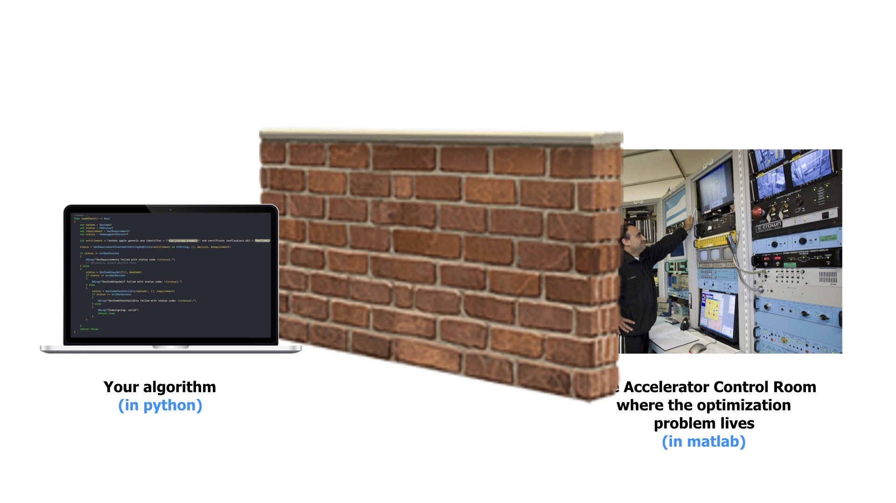

layout: true
name: blank

---

layout: true
name: cover
class: middle, left

---

layout: true
name: blank-backlog
background-image: url(images/background/iceberg-20.png)
background-position: bottom -3em right -2.5em
background-size: 15%

---

layout: true
name: cover-backlog
background-image: url(images/background/iceberg-20.png)
background-size: 50%

<!-- Beginning of the Slides -->

---

layout: true
template: cover

<!-- Title -->

---

name: title

# [.title[Teeport]](https://teeport.ml/tasks)
.my-n3[
]

## Break the Wall between the Optimization Algorithms and Problems
.py-4[
]

[Zhe](https://github.com/wenatuhs).highlight.sup[*] [ZHANG](mailto:zhezhang@slac.stanford.edu)  
.text-muted[10/21/2020]

.footnote[
.highlight.mid[\\*] call me *Jay* if you have difficulty pronouncing it
]

---

exclude: true

.left-5[
1. This is an inline integral: $\int_a^bf(x)dx$
2. More $x={a \over b}$ formulae.
]

.right-5[
Display formula:

$$e^{i\pi} + 1 = 0$$
]

---

layout: true
template: blank
name: motivation

# [Motivation](#index)

---

layout: true
template: motivation

## Optimizations in the accelerator field

---

name: opt-acc

.left-5[
Lots of optimization algorithm applications in the field


]

--

.right-5[
Even more optimization packages/platforms available

- [**PaGMO**](https://github.com/esa/pagmo2)/[**PyGMO**](https://github.com/esa/pygmo2) .badge.badge-secondary[c++/python]  
.text-muted.small[MOGA optimization package]
- [**pymoo**](https://pymoo.org/) .badge.badge-secondary[python]  
.text-muted.small[Another MOGA optimization package]
- [**PlatEMO**](https://github.com/BIMK/PlatEMO) .badge.badge-secondary[matlab]  
.text-muted.small[Collection of the latest MOGA algorithms/test suites]
- [**Ocelot**](https://github.com/ocelot-collab/optimizer) .badge.badge-secondary[python]  
.text-muted.small[Designed for accelerator machine interface]
- [**xopt**](https://github.com/ChristopherMayes/xopt) .badge.badge-secondary[python]  
.text-muted.small[Parallel optimization]
- [**...**](https://github.com/search?q=optimization+platform) .badge.badge-primary[500+]  
.text-muted.small[Optimization + platform on Github]
]

---

layout: true
template: motivation

## The wall

---

name: the-wall

.center[

]

---

count: false

.center[

]

---

count: false

.center[

]

---

count: false

.center[

]

---

count: false

.center[

]

---

count: false

.center[

]

---

count: false

.center[

]

---

count: false

.center[

]

---

layout: true
template: blank
name: teeport-basics

# [Teeport 101](#index)

---

name: naming

## Naming

.highlight[**Teeport**] .mono[===] .highlight[**T**]ask-based .highlight[**e**]xtensible .highlight[**e**]mbeddable .highlight[**p**]latform for .highlight[**o**]ptimization and .highlight[**r**]eal-time .highlight[**t**]esting

--

name: principles

## Design principles

- .highlight[Minimize] the effort of the integration
    - Mininal interface
- .highlight[Embeddable] to the existed workflow
- .highlight[Ensure] the data safety
    - Never lose the precious data, under *any* circumstances

---

name: concepts

## Concepts

.left-5[
### Evaluator

An implementation of a optimization problem. Usually can be abstracted as a function:
```python
Y = evaluate(X, configs)
```

The `configs` variable is the configuration of the problem, say:
```python
configs = {
    'noise_level': 0.1, # emulate the experimental env
    'wall_time': 1, # emulate the experimental env
    ...
}
```
]

.right-5[
### Optimizer

An implementation of an optimization algorithm:
```python
x_best = optimize(evaluate, configs)
```

The `evaluate` variable is the target function to be optimized:
```python
Y = evaluate(X)
```

An example of `configs`:
```python
configs = {
    'D': 8, # dimension of the problem to be optimized
    'N': 300, # maximum iterations
    ...
}
```
]

---

count: false

## Concepts

.left-5[
### Processor

A function that processes data and return the processed result:
```python
result = process(data, configs)
```

An example of `configs`:
```python
configs = {
    'return_grad': False,
    'ard': True,
    ...
}
```
]

---

layout: true
template: blank
name: api-design

# [API Design](#index)

---

name: use-evaluator

.left-5[
## For algorithm developers

- .current[Use an evaluator]  
`use_evaluator(id: string)`
]

.right-5[
### Usage

```python
from teeport import Teeport

# Connect to the platform
teeport = Teeport('ws://localhost:8080/')

# Use the evaluator
*evaluate = teeport.use_evaluator('c4oiY1_oe')

X = np.random.rand(30, 8)
Y = evaluate(X)
```
]

---

name: run-optimizer
count: false

.left-5[
## For algorithm developers

- Use an evaluator  
`use_evaluator(id: string)`
- .current[Ship an optimizer]  
`run_optimizer(optimize: function)`
]

.right-5[
### Usage

```python
from teeport import Teeport

# Connect to the platform
teeport = Teeport('ws://localhost:8080/')

# Ship the algorithm
*teeport.run_optimizer(optimize)
# optimizer id: vRpl0gFr_
```

### The `optimize` function
```python
def optimize(evaluate):
    # Y = evaluate(X)
    #
    # X and Y are 2D arrays
    # shape of X: (N, D)
    # shape of Y: (N, O)
    # where N the number of points
    # D the dimension of the decision vector
    # O the dimension of the objective vector
    ...
```
]

---

name: use-optimizer
count: false

.left-5[
## For algorithm developers

- Use an evaluator  
`use_evaluator(id: string)`
- Ship an optimizer  
`run_optimizer(optimize: function)`

## For algorithm users

- .current[Use an optimizer]  
`use_optimizer(id: string)`
]

.right-5[
### Usage

```python
from teeport import Teeport

# Connect to the platform
teeport = Teeport('ws://localhost:8080/')

# Use the optimizer
*optimize = teeport.use_optimizer('isBiBX4Rv')

optimize(evaluate)
```

### The `evaluate` function
```python
def evaluate(X):
    # X and Y are 2D arrays
    # shape of X: (N, D)
    # shape of Y: (N, O)
    # where N the number of points
    # D the dimension of the decision vector
    # O the dimension of the objective vector
    ...
    return Y
```
]

---

name: run-evaluator
count: false

.left-5[
## For algorithm developers

- Use an evaluator  
`use_evaluator(id: string)`
- Ship an optimizer  
`run_optimizer(optimize: function)`

## For algorithm users

- Use an optimizer  
`use_optimizer(id: string)`
- .current[Ship an evaluator]  
`run_evaluator(evaluate: function)`
]

.right-5[
### Usage

```python
from teeport import Teeport

# Connect to the platform
teeport = Teeport('ws://localhost:8080/')

# Ship the problem
*teeport.run_evaluator(evaluate)
# evaluator id: S6QV_KO-s
```

### The `evaluate` function
```python
def evaluate(X):
    # X and Y are 2D arrays
    # shape of X: (N, D)
    # shape of Y: (N, O)
    # where N the number of points
    # D the dimension of the decision vector
    # O the dimension of the objective vector
    ...
    return Y
```
]

---

name: use-processor
count: false

.left-5[
## For algorithm developers

- Use an evaluator  
`use_evaluator(id: string)`
- Ship an optimizer  
`run_optimizer(optimize: function)`

## For algorithm users

- Use an optimizer  
`use_optimizer(id: string)`
- Ship an evaluator  
`run_evaluator(evaluate: function)`

## For both
- .current[Use a processor]  
`use_processor(id: string)`
]

.right-5[
### Usage

```python
from teeport import Teeport

# Connect to the platform
teeport = Teeport('ws://localhost:8080/')

# Use the processor
*process = teeport.use_processor('BLBaVJxOy')

result = process(data)
```
]

---

name: run-processor
count: false

.left-5[
## For algorithm developers

- Use an evaluator  
`use_evaluator(id: string)`
- Ship an optimizer  
`run_optimizer(optimize: function)`

## For algorithm users

- Use an optimizer  
`use_optimizer(id: string)`
- Ship an evaluator  
`run_evaluator(evaluate: function)`

## For both
- Use a processor  
`use_processor(id: string)`
- .current[Ship a processor]  
`run_processor(process: function)`
]

.right-5[
### Usage

```python
from teeport import Teeport

# Connect to the platform
teeport = Teeport('ws://localhost:8080/')

# Ship the processor
*teeport.run_processor(process)
# processor id: BLBaVJxOy
```

### The `process` function
```python
def process(data):
    # data can be any serializable object
    # result can be any serializable object
    ...
    return result
```
]

---

layout: true
template: blank
name: teeport-basics-plus

# [Teeport 101+](#index)

---

## There is a Tee in Teeport

<!-- .highlight[**Teeport**] connects the *optimizer* and the *evaluator*.  
But .highlight[**Teeport**] is more than that. -->

.center[

]

--

<div class='bold' style='position: absolute; top: 70%; left: 33%'>
    Optimizer
</div>
<div class='bold' style='position: absolute; top: 70%; left: 59%'>
    Evaluator
</div>

--

<div class='bold' style='position: absolute; top: 83%; left: 47%'>
    Monitor
</div>

--

<div class='bold highlight' style='position: absolute; top: 31%; left: 47%'>
    Control
</div>

---

name: concepts-cont

## Concepts+

.left-5[
### Monitor

A visualization of the data flow between the [**optimizer**](#concepts) and the [**evaluator**](#concepts) that catches some feature of the data.

Examples:

]

---

layout: true
template: blank
name: frontend

# [Frontend of Teeport](#index)

---

name: desktop

<div class='w-100 overflow-hidden' style='height: 512px'>
    <iframe
        width='125%' height='640' frameborder='0'
        style='-webkit-transform: scale(0.8);-webkit-transform-origin: 0 0;'
        src='https://teeport.ml/tasks'
    ></iframe>
</div>

---

name: mobile
count: false

.center[

]

<div class='overflow-hidden'
    style='position: absolute; width: 207px; height: 368px; left: 501px; top: 152px;'
>
    <iframe
        width='414' height='736' frameborder='0'
        style='-webkit-transform: scale(0.5);-webkit-transform-origin: 0 0;'
        src='https://teeport.ml/tasks'
    >
    </iframe>
</div>

---

layout: true
template: blank
name: api-design-cont

# [API Design+](#index)

---

name: monitor-eval

.left-5[
## For algorithm developers

- .current[Monitor an evaluator]  
`use_evaluator(evaluate: function)`
]

.right-5[
### Usage

```python
from teeport import Teeport

# Connect to the platform
teeport = Teeport('ws://localhost:8080/')

# Monitor the problem
*evaluate = teeport.use_evaluator(evaluate)

X = np.random.rand(30, 8)
Y = evaluate(X)
```

### The `evaluate` function
```python
def evaluate(X):
    # X and Y are 2D arrays
    # shape of X: (N, D)
    # shape of Y: (N, O)
    # where N the number of points
    # D the dimension of the decision vector
    # O the dimension of the objective vector
    ...
    return Y
```
]

---

count: false

name: monitor-opt

.left-5[
## For algorithm developers

- Monitor an evaluator  
`use_evaluator(evaluate: function)`
- .current[Monitor an optimizer]  
`use_optimizer(optimize: function)`
]

.right-5[
### Usage

```python
from teeport import Teeport

# Connect to the platform
teeport = Teeport('ws://localhost:8080/')

# Monitor the algorithm
*optimize = teeport.use_optimizer(optimize)

optimize(evaluate)
```

### The `optimize` function
```python
def optimize(evaluate):
    # Y = evaluate(X)
    #
    # X and Y are 2D arrays
    # shape of X: (N, D)
    # shape of Y: (N, O)
    # where N the number of points
    # D the dimension of the decision vector
    # O the dimension of the objective vector
    ...
```
]

---

layout: true
template: blank
name: applications

# [Applications](#index)

---

layout: true
template: applications

## SPEAR3 beam loss rate remote optimization

---

name: applications-lossrate

.left-5[
.center[

]]

.right-5[
[**Lossrate Exp Evaluator**](https://github.com/SPEAR3-ML/lossrate-exp-evaluator) .badge.badge-secondary[matlab]
.mb-n3[
]
.text-muted.small[The SPEAR3 beam loss rate evaluator for online
optimization]

.frame-3x4[.frame-i[
```matlab
function lossrate = getlossrate(duration)
    injpv = getpv('SPEAR:InjectState');
    if injpv>0
        time_lastInj = now;
        while getpv('SPEAR:InjectState')
            pause(2.0);
            time_lastInj = now;
        end
    end
    while (now-time_lastInj)*3600*24 < duration+5.0 %seconds
        pause(0.5);
    end

    duration = ceil(duration);

    st = now;
    cur0 = getdcct;
    while (now-st)*3600*24<duration
        pause(0.1);
    end
    cur1 = getdcct;
    lossrate = -(cur1-cur0)*60./duration;
end

function lossrate_evaluator()
    % change to the directory that contains this file
    cd(fileparts(which(mfilename)));
    
    % integrate into the platform
    addTeeportPath; % just in case
*   teeport = Teeport('ws://lambda-sp3:8090/');
*   evaluatorId = teeport.runEvaluator(@evaluate);
    fprintf('evaluatorId: %s\n', evaluatorId);
    
    % create the clean up object
    cleanupObj = onCleanup(@()cleanup(teeport));
    pause(); % prevent the function from completing
end
```
]]]

---

count: false

.left-5[
.center[

]]

.right-5[
MG-GPO vs PSO.highlight.sup[*]

]

.footnote[
.highlight.mid[\\*] PSO .mono[===] Particle Swarm Optimization
]

---

layout: true
template: applications

## Enhance MG-GPO with GPy

---

name: applications-gpy

.left-5[
.center[

]]

.right-5[
MG-GPO side
.my-n2[
]

.frame-2x5[.frame-i[
```matlab
%% Run
if useTeeport ~= 0
    % Read the platform settings
    fid = fopen('.teeport');
    url = fgetl(fid);
    if url == -1
        fclose(fid);
        error('Cannot read the url of the platform.')
    end
    processorId = fgetl(fid);
    if processorId == -1
        fclose(fid);
        error('Cannot read the id of the GPy processor on the platform.')
    end
    fclose(fid);
    
    % Connect to the platform
    teeport = Teeport(url);
    evaluate = teeport.useEvaluator(problem);
*   predict = teeport.useProcessor(processorId);
    
    gbest = MGGPO(evaluate,predict,Npop,Ngen,Nobj,Nvar);
    teeport.cleanUp(); % disconnect from the platform
else
    addpath GP;
    evaluate = problem;
    predict = @GP_predict;
    
    gbest = MGGPO(evaluate,predict,Npop,Ngen,Nobj,Nvar);
end
```
]]

GPy side
.my-n2[
]

.frame-2x5[.frame-i[
```python
# opt/processors/gpt_predictor.py
def process(X, configs=None):
    X0 = np.array(X[0][0])
    Y0 = np.array(X[0][1])
    X1 = np.array(X[1])
    
    Y0_mean = np.mean(Y0, axis=0)
    _Y0 = Y0 - Y0_mean
    
    predict = model(X0, _Y0, configs)
    _Y1_mu, Y1_sigma, Y1_mu_grad, Y1_sigma_grad = predict(X1)
    Y1_mu = _Y1_mu + Y0_mean
    
    if Y1_mu_grad is None:
        P = [Y1_mu.tolist(), Y1_sigma.tolist()]
    else:
        P = [Y1_mu.tolist(), Y1_sigma.tolist(), Y1_mu_grad.tolist(), Y1_sigma_grad.tolist()]
    return P

# run_gpy_predictor.py
import numpy as np
import nest_asyncio
nest_asyncio.apply()
import asyncio
from functools import partial

from teeport import Teeport
from opt.processors.gpy_predictor import process

teeport = Teeport('ws://lambda-sp3:8090/')
*teeport.run_processor(partial(process, configs={}), 'GPy Predictor')
print('processor is running...')

loop = asyncio.get_event_loop()
loop.run_until_complete(teeport.processors[0].task)
```
]]]

---

layout: true
template: applications

## Extend the ability of Ocelot

---

name: applications-ocelot

.left-5[
.center[

]]

.right-5[
[**Injeff Exp Evaluator**](https://github.com/SPEAR3-ML/injeff-exp-evaluator) .badge.badge-secondary[matlab]
.mb-n3[
]
.text-muted.small[The SPEAR3 injection efficiency evaluator for online
optimization]

.frame-3x4[.frame-i[
```matlab
PVs = {
    'MS1-SFM:CurrSetpt'
    'MS2-SF:CurrSetpt'
    'MS3-SF:CurrSetpt'
    'MS4-SF:CurrSetpt'
    'MS5-SF:CurrSetpt'
    'MS1-SDM:CurrSetpt'
    'MS2-SD:CurrSetpt'
    'MS3-SD:CurrSetpt'
    'MS4-SD:CurrSetpt'
    'MS5-SD:CurrSetpt'
};
```
]]]

---

exclude: true

## Teeport features summary

.left-5[
### Using just the packages
- Minimal effort of integration
- Minimal interface to access an .highlight[evaluator]/.highlight[optimizer]
- Enable the developer to use packages written in any programing languages

___

- Break the wall between the .highlight[evaluator] and the .highlight[optimizer]
- Fast switch between .highlight[evaluator]/.highlight[optimizer]

___

- Completely decouple the .highlight[evaluator] and the .highlight[optimizer]
- Once develeped, use everywhere
- Easy to extend, one package for each language and that's all
- Work well with the existing platforms that collect lots of algorithms/test suites
]

--

exclude: true

.right-5[
### Using the frontend
- Monitoring
- Control
- Benchmarking
- Exporting .text-muted[(so you're not locked in)]
- Population/individual evaluation

___

- `Time travel`
]

---

exclude: true
name: time-travel

## About `time travel`

---

exclude: true
name: data-safety

## Data safety

---

layout: true
template: blank
name: summary

# [Summary](#index)

---

name: features

## Features

- .highlight[Maximize] the flexibility of the algorithm developer and the user
    - Use any programming languages
    - Code the way they like
- .highlight[Minimize] the effort of the integration
    - Mininal interface
- .highlight[Embeddable] to the existed workflow
- .highlight[Enrich] the user experience
    - Control
    - Monitor
    - Benchmark
    - And more
- .highlight[Ensure] the data safety
    - Never lose the precious data, under *any* circumstances

---

name: repos

.left-5[
## Core repositories

- [**Teeport Backend**](https://github.com/SPEAR3-ML/teeport-backend) .badge.badge-secondary[javascript/docker]  
.text-muted.small[Backend for the Teeport platform
]
- [**Teeport Frontend**](https://github.com/SPEAR3-ML/teeport-frontend) .badge.badge-secondary[javascript/html/css/docker]  
.text-muted.small[Frontend for the Teeport platform
]
- [**Teeport Client for Python**](https://github.com/SPEAR3-ML/teeport-client-python) .badge.badge-secondary[python]  
.text-muted.small[Python client of the Teeport platform
]
- [**Teeport Client for Matlab**](https://github.com/SPEAR3-ML/teeport-client-matlab) .badge.badge-secondary[matlab]  
.text-muted.small[Matlab client of the Teeport platform
]
]

.right-5[
## Extension repositories

- [**SPEAR3 Opt Toolbox**](https://github.com/SPEAR3-ML/spear3-opt-pkg) .badge.badge-secondary[python]  
.text-muted.small[SPEAR3 online optimization toolbox
]
- [**Teeport Plugins**](https://github.com/SPEAR3-ML/teeport-plugins) .badge.badge-secondary[python]  
.text-muted.small[Optimizers, evaluators and processors for
the Teeport platform]
]

---

layout: true
template: blank

# [Acknowledgements](#index)

---

name: acknowledgements

- [**Xiaobiao Huang**](mailto:huangxb@anl.gov) .badge.badge-primary[sponsor]  
.text-muted.small[For the support.highlight.sup[1, 2, 3] and many good advices
]
- [**Minghao Song**](mailto:mhsong@slac.stanford.edu) .badge.badge-primary[user#1]  
.text-muted.small[For the early testing/debugging and the helpful feedbacks  
Also for the contribution to the matlab Teeport plugin
]
- [**Adi Hanuka**](mailto:adiha@slac.stanford.edu) .badge.badge-primary[advocate]  
.text-muted.small[For the very helpful discussions and advices  
Also for the kind advertising for Teeport!
]

.footnote[
.highlight[1.] U.S. Department of Energy, Office of Science, Office of Basic Energy Sciences, Contract No. *DE-AC02-76SF00515*  
.highlight[2.] U.S. Department of Energy, Office of Science, Office of Basic Energy Sciences, *FWP 2018-SLAC-100469*  
.highlight[3.] U.S. Department of Energy, Computing Science, Office of Advanced Scientific Computing Research, *FWP 2018-SLAC-100469ASCR*
]

---

template: cover
name: thanks

# Thanks.text-primary[!]
.my-n3[
]

## [Questions and comments](#index) are welcome

---

template: blank
name: index
count: false

# [Index](#thanks)

.left-5[
## Outlines

### [Motivation](#opt-acc)
- [Optimizations in the accelerator field](#opt-acc)
- [The wall](#the-wall)

### [Teeport](#principles)
- [Design principles](#principles)
- [Concepts](#concepts) `&` [Concepts+](#concepts-cont)
- [API](#run-processor) `&` [API+](#monitor-opt)
- [Desktop](#desktop) `&` [Mobile](#mobile)
- [Features](#features)
- [Repositories](#repos)

### [Applications](#applications-injeff)
- [SPEAR3 beam loss rate remote optimization](#applications-lossrate)
- [Enhance MG-GPO with GPy](#applications-gpy)
- [Extend the ability of Ocelot](#applications-ocelot)
]

.right-5[
## Backlog

### [FAQ](#cons-prob)
- [Constrained/safety problems?](#cons-prob)
- [In LCLS control room?](#no-network)
- [How to pass the Pareto front?](#calc-igd)
- [How to carry more information?](#carry-more)
- [Monitor some other features?](#monitor-feature)

### [Teeport+](#teeport-arch)
- [Architecture](#teeport-arch)
- [Key design](#key-design)

### [Misc](#about)
- [How did you make these slides?](#about)
]

---

layout: true
template: blank-backlog
name: faq

# [FAQ](#index)

---

name: cons-prob
count: false

## Constrained problems in Teeport

---

name: no-network
count: false

## What if no network access

---

name: calc-igd
count: false

## How to pass the Pareto front

---

name: carry-more
count: false

## How to carry more information

---

name: monitor-feature
count: false

## Monitor some other features

---

layout: true
template: blank-backlog
name: b-teeport

# [Teeport](#index)

---

layout: true
template: b-teeport
name: b-teeport-arch

## Architecture

---

layout: true
template: b-teeport-arch

.left-5[
.highlight[**Teeport**] at its core: a `RTC` system between different type of clients
- An optimization process is a .highlight[task]
- A .highlight[task] must has an .highlight[optimizer] client and an .highlight[evaluator] client
    - The .highlight[optimizer] client holds an `optimize` function
    - The .highlight[evaluator] client holds an `evaluate` function
]

---

name: teeport-arch
count: false

.right-5[
### General case
.frame-9x10[.frame-i[
.center[

]]]]

---

count: false

.right-5[
### `use_evaluator(id: string)` case
.frame-9x10[.frame-i[
.center[

]]]]

---

count: false

.right-5[
### `use_optimizer(id: string)` case
.frame-9x10[.frame-i[
.center[

]]]]

---

count: false

.right-5[
### `use_evaluator(evaluate: function)` and `use_optimizer(optimize: function)` cases

.center[

]]

---

layout: true
template: b-teeport-arch

.left-5[
.highlight[**Teeport**] at its core: a `RTC` system between different type of clients
- An optimization process is a .highlight[task]
- A .highlight[task] must has an .highlight[optimizer] client and an .highlight[evaluator] client
    - The .highlight[optimizer] client holds an `optimize` function
    - The .highlight[evaluator] client holds an `evaluate` function
- Clients communicate with each other by the `websocket` protocol
]

---

count: false

.right-5[
.frame-1x1[.frame-i[

]]]

---

name: teeport-signal-seq
count: false

.right-5[
.frame-1x1[.frame-i[
<div class='mermaid'>
sequenceDiagram
    Note over Wildcard: Get optimizer/evaluator id
    Wildcard->>+Server: init task
    Server->>Server: create task in memory
    par
        Server->>+Monitor: start task
        Monitor->>-Monitor: create task in memory
    and
        Server->>-Optimizer: start task
    end
    loop optimization
        activate Optimizer
        Optimizer->>Optimizer: generate next X
        Optimizer->>+Server: evaluate X
        deactivate Optimizer
        Server->>Server: add X to pending queue
        Server->>-Evaluator: evaluate X
        activate Evaluator
        Evaluator->>Evaluator: calculate Y = f(X)
        Evaluator->>+Server: evaluated Y
        deactivate Evaluator
        Server->>Server: remove X from pending queue
        Server->>Server: add [X, Y] to history list
        par
            Server->>+Monitor: evaluated Y
            Monitor->>-Monitor: add Y to history list
        and
            Server->>-Optimizer: evaluated Y
        end
    end
    Note over Optimizer: Meet termination condition
    Optimizer->>+Server: task completed
    Server->>Server: dump task to DB
    Server->>-Monitor: task completed
</div>
]]]

---

template: b-teeport-arch
count: false

.left-5[
### The client structure

.frame-9x10[.frame-i[
```js
const clientDef = () => {
  return {
    name: null,
    type: null,
*   classId: null, // like NSGA-II and ZDT-2
    private: false,
    taskId: null,
    connectedAt: null,
    configs: {},
    descr: null,
  }
}
```
]]]

.right-5[
### The task structure

.frame-9x10[.frame-i[
```js
const taskDef = () => {
  return {
    name: null,
    createdAt: null,
    startedAt: null,
    stoppedAt: null,
    archivedAt: null,
    status: 'init',
    optimizerId: null, // optimizer socket id
*   algorithmId: null, // optimizer id, like NSGA-II
    evaluatorId: null, // evaluator socket id
*   problemId: null, // evaluator id, like ZDT-2
    pending: [],
    history: [],
    configs: {},
    descr: null,
  }
}
```
]]]

---

template: b-teeport-arch
count: false

.left-5[
### The client structure

.frame-9x10[.frame-i[
```js
const clientDef = () => {
  return {
    name: null,
    type: null,
    classId: null, // like NSGA-II and ZDT-2
    private: false,
    taskId: null,
    connectedAt: null,
    configs: {},
    descr: null,
  }
}
```
]]]

.right-5[
### The task structure

.frame-9x10[.frame-i[
```js
const taskDef = () => {
  return {
    name: null,
    createdAt: null,
    startedAt: null,
    stoppedAt: null,
    archivedAt: null,
    status: 'init',
    optimizerId: null, // optimizer socket id
    algorithmId: null, // optimizer id, like NSGA-II
    evaluatorId: null, // evaluator socket id
    problemId: null, // evaluator id, like ZDT-2
*   pending: [],
*   history: [],
    configs: {},
    descr: null,
  }
}
```
]]]

---

layout: true
template: b-teeport

## Key design

---

name: key-design
count: false

.left-5[
### Multi-threading in clients

For the `use_evaluator(id: string)` API, what's the corresponding `optimize` function?
- The `optimize` function has to be bound to the .highlight[optimizer] client and keeps running all the time
- It needs to "generate" an `X` when the user calls `evaluate(X)`
]

.right-5[
.frame-9x10[.frame-i[
.center[

]]]]

---

name: multi-thread-seq
count: false

.left-5[
### Multi-threading in clients

.frame-9x10[.frame-i[
<div class='mermaid'>
sequenceDiagram
    participant H as Human
    participant E as Evaluate Func
    participant O as Optimize Func
    participant S as Socket Thread

    H->>E: first call with X0
    E->>O: create with X0
    par
        E->>E: start eval thread
        activate E
        Note over E: wait for Y0
    and
        O->>+S: evaluate X0
    end
    Note over S: get Y0 from server
    S->>-O: evaluated Y0
    O->>E: set result Y0
    deactivate E
    par
        O->>O: start opt thread
        activate O
        Note over O: wait for X
    and
        E->>H: return Y0
    end

    loop
        H->>E: call with X
        E->>O: set result X
        deactivate O
        par
            E->>+E: start eval thread
            Note over E: wait for Y
        and
            O->>+S: evaluate X
        end
        Note over S: get Y from server
        S->>-O: evaluated Y
        O->>E: set result Y
        deactivate E
        par
            O->>O: start opt thread
            activate O
            Note over O: wait for X
        and
            E->>H: return Y
        end
    end
    deactivate O
</div>
]]]

.right-5[
.frame-1x1[.frame-i[
```python
def use_evaluator(self, evaluate=None, class_id=None, name=None, configs=None):
    if self.evaluator:
        if self.evaluator.task:
            print('teeport: please stop the current evaluator first')
            return
    
    if evaluate is None:
        return
    elif type(evaluate) == str:
        # do this link/unlink thing so that users don't need to care about it
        if self.is_busy():
            client = self.wildcard.check_client(evaluate)
        else:
            self.link()
            client = self.wildcard.check_client(evaluate)
            self.unlink()
        try:
            client_type = client['type']
        except:
            print(f'teeport: evaluator {evaluate} does not exist')
            return None
        else:
            if client_type != 'evaluator':
                print(f'teeport: client {evaluate} is not an evaluator')
                return None
            
            # init an evaluator, this one will not run
            # use configs passed from use_evaluator if possible
            configs_init = configs or client['configs']
*           evaluator = Evaluator(self.uri, client['classId'], client['name'], configs_init, local=False)
            evaluator.id = client['id']
            self.evaluator = evaluator
*           evaluate_w = self._get_evaluate_remote(evaluator.id, configs_init)
            self.evaluator.evaluate = evaluate_w
            return evaluate_w
    else:
        return self._get_evaluate_local(evaluate, class_id, name, configs)

def _get_evaluate_remote(self, evaluator_id, configs):
    # configs is a needed argument
    # so be sure to get it in advance in the caller method

    # closure trick
    cache = {
        'count': 0,  # called number
        'opt_task': None,  # get X in optimize
        'eval_task': None  # get Y in evaluate
    }
    configs_init = configs

    @make_sync
    async def evaluate_w(X):
        if cache['eval_task'] and not cache['eval_task'].done():
            cache['eval_task'].cancel()
            print('teeport: something goes wrong on evaluation')
            return

*       cache['eval_task'] = asyncio.get_event_loop().create_future()

        if cache['count'] == 0:  # first time run evaluate
            # create the manual optimizer
            # the manual optimizer does not respect the configs
            async def optimize(func, configs=None):
                while True:
                    if not cache['opt_task']:  # first loop
                        cache['opt_task'] = asyncio.get_event_loop().create_future()
                        Y = func(X)
                        cache['eval_task'].set_result(Y)
                    else:
*                       cache['opt_task'] = asyncio.get_event_loop().create_future()
*                       _X = await cache['opt_task']  # avoid the late-bind issue of X in the closure
                        Y = func(_X)
*                       cache['eval_task'].set_result(Y)

            # run optimizer and get the socket id
            connected = asyncio.get_event_loop().create_future()
            def connected_callback():
                connected.set_result(True)

            def finished_callback():
                # unlink the wildcard
                self.unlink()
                # stop the optimizer
                if self.optimizer:
                    self.optimizer.stop()
                # cancel the tasks in cache
                if cache['opt_task'] and not cache['opt_task'].done():
                    cache['opt_task'].cancel()
                if cache['eval_task'] and not cache['eval_task'].done():
                    cache['eval_task'].cancel()

            success = self.run_optimizer(optimize, private=True,
                                         connected_callback=connected_callback,
                                         finished_callback=finished_callback)
            if not success:
                return

            await connected
            optimizer_id = self.optimizer.id

            configs_all = {
                'evaluator': configs_init
            }
            self.link()
*           self.wildcard.init_task(optimizer_id, evaluator_id, configs_all)
        else:
            if cache['opt_task'] and not cache['opt_task'].done():
*               cache['opt_task'].set_result(X)
            else:
                print('teeport: something goes wrong on optimization')
                return

*       Y = await cache['eval_task']
        cache['count'] = cache['count'] + 1
        return Y
    return evaluate_w
```
]]]

---

count: false

.left-5[
### Control mechanism

Set the status of .highlight[task] and use `pending` as cache:
.frame-3x5[.frame-i[
```js
const taskDef = () => {
  return {
    name: null,
    createdAt: null,
    startedAt: null,
    stoppedAt: null,
    archivedAt: null,
*   status: 'init', // running/paused/done
    optimizerId: null, // optimizer socket id
    algorithmId: null, // optimizer id, like NSGA-II
    evaluatorId: null, // evaluator socket id
    problemId: null, // evaluator id, like ZDT-2
*   pending: [],
    history: [],
    configs: {},
    descr: null,
  }
}
```
]]]

.right-5[
### Monitor memory trick

Only sync the `Y` data to the .highlight[monitor], to let the browser be able to survive the huge data when doing high dimensional.highlight.sup[*] optimization
- Retrieve the `X` data on demands

### Sockets management

Only connect to the .highlight[Teeport] server when necessary.
- Check if the requested .highlight[optimizer]/.highlight[evaluator] exists
- During optimization
]

.footnote[
.highlight.mid[\\*] the typical data size for NSGA-II running on a 500D problem until converging is around .highlight[**1GB**]
]

---

exclude: true

## Key design

### Connection interruption`/`time travel

They are of the same nature: continue running from a given state.

---

layout: true
template: blank-backlog
name: b-misc

<!-- Misc -->

# [Misc](#index)

---

name: about
count: false

## About the slides

.left-5[
### Info
- Framework: [**Remark**](https://github.com/gnab/remark)
- Language: `markdown`
- Fonts: [**Tahoma**](https://docs.microsoft.com/en-us/typography/font-list/tahoma), [**Fira Code**](https://github.com/tonsky/FiraCode)
- Libraries:
    - [**Mermaid.js**](https://github.com/mermaid-js/mermaid) for diagrams
    - [**Bootstrap**](https://github.com/twbs) for styling
    - [**KaTeX**](https://github.com/KaTeX/KaTeX) for math typesetting

### Statistics
- Total line number.highlight.sup[*]: .highlight[3,000+]
- Total commits: .highlight[17]
- First commit: .highlight[09/02/2020 PT]
]

.footnote[
.highlight.mid[\\*] counted by [**cloc**](https://github.com/AlDanial/cloc), blank lines and comments not included
]

.right-5[
[**Teeport Intro**](https://github.com/wenatuhs/work-overview) .badge.badge-secondary[markdown/html/css/javascript]
.mb-n3[
]
.text-muted.small[Overview of my work, made with remark.js
]

.frame-2x3[.frame-i[
```markdown
layout: true
template: cover

---

name: title

# Work Overview

[Zhe](https://github.com/wenatuhs).highlight.sup[*] ZHANG  
.text-muted[09/2020]

.footnote[
.highlight.mid[\\*] call me *Jay* if you have difficulty pronouncing it
]

---

layout: true
template: blank

---

name: self-intro

# [Self introduction](#index)

## Education
- .time-range[2011-2017] .d-flex.mb-n2[Ph.D. in Accelerator Physics, Tsinghua University, China  
(Supervisor: Prof. Chuanxiang TANG)]
- .time-range[2007-2011] .d-flex.mb-n2[B.Sc. in Engineering Physics, Tsinghua University, China  
(.important[GPA 90.6, Rank 5/150])]
- .time-range[2014 03-12] .d-flex[VGR in Pegasus Group, UCLA, USA]
- .time-range[2013 03-06] .d-flex[VGR in PSI, Switzerland]

## Work
- .time-range[2019-] .d-flex.mb-n2[Research Associate, SLAC National Accelerator Laboratory  
(Supervisor: Dr. Xiaobiao Huang)]
- .time-range[2018-2019] .d-flex[Algorithm Engineer, Visual3D Inc., China]
- .time-range[2017-2018] .d-flex[Fullstack Engineer, Visual3D Inc., China]

## Non-trivial Honors
- .time-range[2016] .d-flex[Grade A+, USPAS 2014, USA (maybe not so non-trivial)]
- .time-range[2012] .d-flex[First-in-class, 7th OCPA, China]

```
]]]
